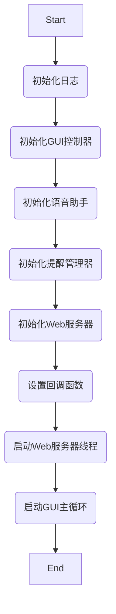
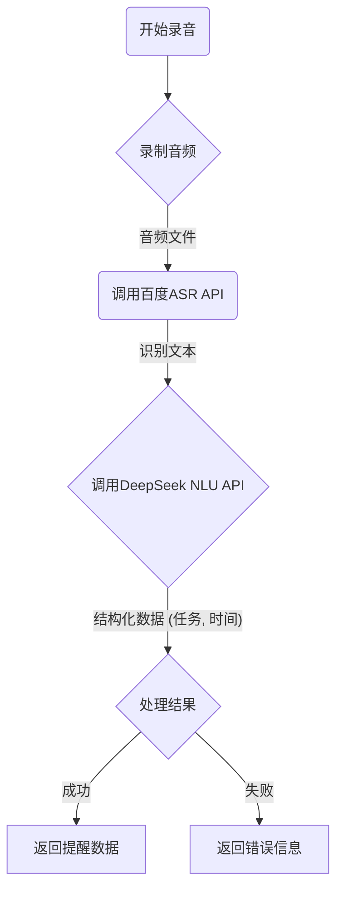

# 嵌入式课程大作业实验报告

## 一、背景

随着社会老龄化进程的加速，如何利用现代科技提升老年人的生活品质，已成为一个重要的社会议题。老年人由于记忆力衰退等原因，常常会忘记吃药、赴约、进行日常活动等重要事项。传统的备忘录方式（如纸质便签、手机APP）对于他们来说，可能存在操作复杂、界面不友好、不易查看等问题。特别是在智能手机普及率相对较低或使用不熟练的老年群体中，这些工具的实用性大打折扣。

本项目旨在设计并实现一个“适老化语音备忘录系统”，专门服务于老年用户群体。该系统以树莓派（Raspberry Pi）为核心硬件平台，结合语音识别、自然语言处理（NLU）、语音合成（TTS）和物联网技术，旨在提供一种极其简单、自然的交互方式来帮助老年人管理日常提醒。

**技术原理与发展现状：**

- **语音交互技术**：近年来，随着深度学习技术的发展，语音识别的准确率大幅提升，已广泛应用于智能音箱、智能家居等领域。本项目利用成熟的云服务API（如百度语音、讯飞语音），实现了高精度的语音到文本（ASR）和文本到语音（TTS）转换，降低了老年人的使用门槛。
- **自然语言理解（NLU）**：简单的关键词匹配已无法满足复杂的用户意图识别。本项目引入了大型语言模型（LLM，如DeepSeek）API，能够从用户的自然语言（如“提醒我明天下午三点喝水”）中准确提取出“任务”和“时间”等关键信息，实现了更智能、更人性化的交互体验。
- **嵌入式系统**：树莓派作为一款功能强大且成本低廉的微型计算机，为本项目提供了理想的硬件基础。其丰富的接口和成熟的社区支持，使得连接麦克风、扬声器、显示屏等外设变得简单可行。

**现有工作与不足：**

市面上已有的一些智能提醒产品，如智能音箱，虽然功能强大，但通常功能冗余，界面复杂，且价格较高，不完全符合老年人的核心需求。一些专门的提醒器则功能单一，缺乏智能化和网络化功能。本项目试图在功能、成本和易用性之间找到一个平衡点，设计一个专注、高效且具有人情味的备忘录系统。

**本项目的创新与价值：**

1.  **极简交互**：专注于语音交互，用户只需通过说话即可完成所有操作，无需学习复杂的界面。
2.  **智能分级提醒**：系统能根据提醒的紧急程度，通过不同的视觉和听觉提示（如颜色变化、声音提示）来区分，帮助用户更好地感知任务的优先级。
3.  **远程亲情互动**：系统集成了Web服务，允许家人或护工通过网页远程为老人设置提醒或发送关怀消息，弥补了物理距离带来的沟通障碍，增强了情感连接。
4.  **高性价比与可扩展性**：基于树莓派和开源软件构建，成本可控，且具有良好的可扩展性，未来可集成更多健康监测或智能家居控制功能。

综上所述，本设计不仅具有重要的社会价值，帮助解决老年人日常生活中的实际困难，也在技术上探索了嵌入式系统、人工智能和物联网技术在养老领域的融合应用，具有良好的实践意义和应用前景。

## 二、系统设计

本系统旨在创建一个专为老年人设计的、以语音交互为核心的智能备忘录。系统整体设计围绕“简单、智能、可靠”三个核心原则展开，确保老年用户能够轻松上手并长期依赖。系统由硬件层、软件层和云服务层三部分构成，协同工作以实现完整功能。

### 2.1 系统总体设计思路

系统的核心思路是：通过一个物理设备（基于树莓派）接收用户的语音指令，将语音指令通过云端API转换为文本并进行自然语言理解，从中提取出需要提醒的“事件”和“时间”。然后，系统在本地设置一个定时任务。当预定时间到达时，系统会通过语音合成（TTS）和图形界面（GUI）两种方式提醒用户。同时，系统还支持通过Web界面接收来自外部（如子女）的文字消息，并能智能识别消息中是否包含提醒事项，实现远程关怀功能。

### 2.2 系统总体架构框图

下面是本系统的总体架构框图，展示了各个模块及其相互关系：

```mermaid
graph TD
    subgraph 用户交互层
        A[用户] -- 语音指令 --> B(麦克风);
        B -- 音频流 --> C{语音助手};
        D[GUI界面] -- 显示提醒/消息 --> A;
        E[扬声器] -- 语音播报 --> A;
    end

    subgraph 核心逻辑层 (运行于树莓派)
        C -- 文本 --> F{自然语言处理};
        F -- 意图/实体 --> G[提醒管理器];
        G -- 更新/触发 --> D;
        G -- 播报请求 --> H{语音合成};
        H -- 音频 --> E;
        I[Web服务器] -- 接收消息 --> F;
        J[按钮控制器] -- 用户操作 --> C;
        J -- 用户操作 --> G;
    end

    subgraph 云服务层
        C -- API调用 --> K(百度语音识别 API);
        K -- 文本结果 --> C;
        F -- API调用 --> L(DeepSeek NLU API);
        L -- 解析结果 --> F;
        H -- API调用 --> M(讯飞语音合成 API);
        M -- 音频数据 --> H;
    end

    subgraph 数据存储
        G -- 读/写 --> N[提醒数据 (reminders.json)];
    end

    A -- 点击按钮 --> J;
```

### 2.3 模块介绍

1.  **用户交互层**:
    *   **GUI界面 (`gui_controller.py`)**: 基于 `PyQt5` 构建，负责在屏幕上显示欢迎信息、实时倒计时、提醒列表和外部消息。界面设计力求简洁、字体宽大，符合老年人的视觉习惯。
    *   **按钮控制器 (`gui_button_controller.py`)**: 管理物理按钮（或GUI按钮）的事件，如“开始录音”、“清除提醒”等，并将用户操作分发到相应的业务逻辑模块。

2.  **核心逻辑层**:
    *   **语音助手 (`voice_assistant.py`)**: 系统的“耳朵”和“大脑”。它负责录制音频，调用百度语音识别API将语音转换为文本，然后调用DeepSeek API对文本进行意图识别和实体提取（如识别出“吃药”和具体时间）。
    *   **提醒管理器 (`reminder.py`)**: 系统的“心脏”。它负责所有提醒的生命周期管理，包括添加、存储、更新和删除提醒。它使用 `APScheduler` 库来精确调度定时任务，并在提醒到期时触发回调。
    *   **Web服务器 (`web_server.py`)**: 基于 `Flask` 框架，开放一个简单的HTTP接口，允许外部设备（如子女的手机或电脑）通过局域网发送文字消息到设备上，实现远程互动。
    *   **语音合成 (`xunfei_tts.py`)**: 系统的“嘴巴”。它调用讯飞语音合成API，将需要播报的文本（如“提醒您，现在是时候吃药了”）转换成自然流畅的语音，通过扬声器播放。

3.  **云服务层**:
    *   **百度语音识别 API**: 提供高精度的语音转文本服务。
    *   **DeepSeek NLU API**: 提供强大的自然语言理解能力，是实现智能识别的关键。
    *   **讯飞语音合成 API**: 提供高质量的语音合成服务。

4.  **数据存储**:
    *   **reminders.json**: 一个简单的JSON文件，用于持久化存储用户的提醒事项，确保在设备重启后提醒不会丢失。

### 2.4 模块之间的联系

整个工作流程如下：

1.  用户按下“录音”按钮，**按钮控制器**通知**语音助手**开始录音。
2.  **语音助手**录制完成后，将音频发送至**百度语音识别API**，获得文本。
3.  **语音助手**将文本发送至**DeepSeek NLU API**，获得结构化的意图和实体（例如：`{intent: 'set_reminder', task: '吃药', time: '2023-10-27 20:00:00'}`）。
4.  **语音助手**将解析结果传递给**提醒管理器**。
5.  **提醒管理器**创建一个新的提醒对象，将其存入`reminders.json`，并设置一个定时任务。
6.  同时，**提醒管理器**调用**GUI控制器**的回调函数，在界面上实时更新倒计时列表。
7.  当提醒时间到达，`APScheduler`触发**提醒管理器**中的回调函数。
8.  该回调函数会调用**语音合成**模块，通过扬声器播报提醒内容，并更新**GUI界面**以高亮显示到期的提醒。
9.  在任何时候，如果**Web服务器**接收到外部消息，它会调用**语音助手**进行处理，如果消息中包含提醒意图，则重复步骤3-8，否则直接在**GUI界面**上显示消息。

通过这种模块化的设计，系统各部分职责分明，易于开发、测试和维护。

## 三、硬件设计

本系统的硬件核心是树莓派3B，它作为主控制器，连接并管理所有外部设备。硬件选型充分考虑了性能、成本和接口的便利性，以确保系统稳定运行且易于搭建。

### 3.1 主要硬件模块介绍

1.  **主控制器：树莓派 3B (Raspberry Pi 3B)**
    *   **用途**：作为整个系统的“大脑”，运行Linux操作系统和Python主程序，处理所有计算任务，包括语音处理、任务调度、网络通信和GUI渲染。
    *   **原理**：是一款基于ARM架构的微型计算机，拥有强大的处理能力、丰富的GPIO（通用输入/输出）引脚、板载Wi-Fi和蓝牙模块，非常适合作为物联网项目的核心。
    *   **技术规格**：
        *   CPU: 1.2GHz 64位四核 ARM Cortex-A53
        *   内存: 1GB LPDDR2
        *   网络: 板载 802.11n Wi-Fi, 蓝牙 4.1
        *   接口: 40个GPIO引脚, 4个USB 2.0端口, HDMI端口, 3.5mm音频/复合视频输出口。

2.  **音频输入：USB麦克风**
    *   **用途**：捕捉用户的语音指令。
    *   **原理**：通过USB接口连接到树莓派，将声波转换为数字音频信号。相比于简单的模拟麦克风，USB麦克风通常内置了ADC（模数转换器）和放大电路，能提供更清晰、干扰更少的音频输入，对于提高语音识别的准确率至关重要。

3.  **音频输出：3.5mm接口扬声器**
    *   **用途**：播放系统的语音提示和提醒音。
    *   **原理**：连接到树莓派的3.5mm音频输出插孔，将系统生成的数字音频信号转换为声波。任何标准的有源音箱或耳机都可以使用。

4.  **显示设备：LCD显示屏 (通过HDMI连接)**
    *   **用途**：显示GUI界面，为用户提供视觉反馈，包括时间、提醒事项、倒计时和状态信息。
    *   **原理**：通过HDMI接口连接到树莓派，作为主显示器。本系统使用PyQt5库在该屏幕上绘制图形用户界面。

5.  **输入设备：按钮 (连接到GPIO)**
    *   **用途**：提供一个物理触发方式来启动录音，作为语音指令的补充，使得操作更加明确和可靠。
    *   **原理**：一个简单的瞬时按钮连接到树莓派的GPIO引脚和GND（地）引脚。通过软件配置，将该GPIO引脚设置为上拉输入模式。当按钮被按下时，引脚电平被拉低，程序通过检测这个电平变化来识别按钮事件。

### 3.2 硬件系统连接图 (Fritzing模型)

由于无法直接生成Fritzing图，以下为硬件连接的文字描述和示意图。在实际操作中，开发者可以使用Fritzing软件绘制详细的电路图。

**连接描述：**

*   **树莓派3B** 作为中心节点。
*   **USB麦克风** 连接到树莓派的任意一个USB端口。
*   **扬声器** 的3.5mm插头连接到树莓派的音频输出口。
*   **LCD显示屏** 通过HDMI线连接到树莓派的HDMI端口。
*   **物理按钮** 的一端连接到树莓派的 **GPIO 17** (物理引脚 11)，另一端连接到 **GND** (物理引脚 9)。

**示意图 (伪代码形式):**

```
Raspberry Pi 3B:
  - USB Port 1 --> USB Microphone
  - HDMI Port --> LCD Display
  - 3.5mm Audio Jack --> Speaker
  - GPIO Pins:
    - Pin 11 (GPIO 17) --> Push Button (Pin 1)
    - Pin 9 (GND)      --> Push Button (Pin 2)
```

这个硬件配置构成了一个完整的交互系统，用户可以通过视觉（屏幕）、听觉（扬声器）和触觉（按钮）与设备进行互动，同时通过麦克风向系统输入指令。

## 四、软件设计

软件是本系统的灵魂，负责实现所有的智能逻辑。整体采用Python语言开发，利用了多个强大的第三方库来简化开发流程并实现复杂功能。软件设计遵循模块化原则，代码结构清晰，易于扩展。

### 4.1 第三方库介绍

-   **PyQt5**: 一个成熟的跨平台GUI框架，用于创建本系统的图形用户界面。它提供了丰富的控件和强大的布局管理功能，使得创建美观且响应迅速的界面成为可能。
-   **Flask**: 一个轻量级的Web应用框架。在本项目中，它用于创建一个简单的Web服务器，接收来自局域网的HTTP POST请求，从而实现远程发送消息的功能。
-   **APScheduler**: 一个强大的Python任务调度库。它被用来在后台精确地管理和触发提醒任务，支持持久化，确保即使程序重启，预定的提醒也不会丢失。
-   **Baidu ASR (aip)**: 百度智能云提供的语音识别SDK。用于将用户录制的音频文件发送到云端，并获取高精度的识别结果（文本）。
-   **DeepSeek API (requests)**: 通过HTTP请求调用DeepSeek大型语言模型。我们构造特定的prompt，让模型从识别出的文本中提取关键信息（意图、任务、时间），实现自然语言理解。
-   **Xunfei TTS (requests, hashlib, base64)**: 讯飞开放平台提供的语音合成服务。通过API调用，将文本转换为自然的语音流，用于播报提醒。
-   **pyaudio**: 用于在Python中处理音频流，是实现录音功能的基础。
-   **wave**: Python标准库，用于读写`.wav`格式的音频文件。
-   **dotenv**: 用于管理环境变量，可以将API密钥等敏感信息存储在`.env`文件中，而不是硬编码在代码里，提高了安全性。

### 4.2 核心代码与流程图

#### 4.2.1 主程序流程 (`main.py`)

主程序负责初始化所有模块，并将它们连接在一起，启动主事件循环。

**流程图:**



**核心代码 (`main.py:VoiceReminderSystem.run`)**

*由于IDE截图不便直接嵌入，此处展示核心逻辑的伪代码* 

```python
# main.py
class VoiceReminderSystem:
    def __init__(self):
        # ... 初始化日志、状态锁等 ...
        self._initialize_components()

    def _initialize_components(self):
        # 1. 初始化GUI，显示欢迎界面
        self.gui_controller = GUIController()
        # 2. 初始化语音助手 (Baidu, DeepSeek)
        self.voice_assistant = VoiceAssistant()
        # 3. 初始化提醒管理器 (APScheduler)
        self.reminder_manager = ReminderManager(voice_callback, display_callback)
        # 4. 初始化Web服务器 (Flask)
        self.web_server = WebServer(message_callback)
        # 5. 设置GUI的回调，将按钮点击事件连接到处理函数
        self.gui_controller.set_callbacks(record_callback=self._start_voice_recording)

    def run(self):
        # 在新线程中启动Web服务器，避免阻塞GUI
        web_thread = threading.Thread(target=self.web_server.run)
        web_thread.daemon = True
        web_thread.start()

        # 启动提醒管理器的调度器
        self.reminder_manager.start()

        # 启动PyQt的事件循环，这是程序的主阻塞点
        self.gui_controller.run()

# 程序入口
if __name__ == "__main__":
    system = VoiceReminderSystem()
    system.run()
```

#### 4.2.2 语音处理流程 (`voice_assistant.py`)

这是实现核心交互逻辑的部分，从录音到解析出提醒信息。

**流程图:**



**核心代码 (`voice_assistant.py:process_voice_command`)**

```python
# voice_assistant.py
class VoiceAssistant:
    def process_voice_command(self):
        # 1. 录制音频并保存为 a.wav
        audio_file = self.record_audio()
        if not audio_file:
            return None

        # 2. 调用百度语音识别API
        text = self.recognize_speech(audio_file)
        if not text:
            return None

        # 3. 调用DeepSeek NLU API进行意图识别和实体提取
        #    Prompt中会包含指令，要求模型返回JSON格式的结果
        parsed_result = self.parse_intent_with_llm(text)
        
        # 4. 检查解析结果是否有效
        if parsed_result and parsed_result.get('intent') == 'set_reminder':
            task = parsed_result.get('task')
            time_str = parsed_result.get('time')
            # ... 将时间字符串转换为datetime对象 ...
            return {'task': task, 'time': datetime_obj}
        else:
            return None
```

#### 4.2.3 提醒管理流程 (`reminder.py`)

负责提醒的添加、调度和触发。

**核心代码 (`reminder.py:add_reminder`)**

```python
# reminder.py
from apscheduler.schedulers.background import BackgroundScheduler

class ReminderManager:
    def __init__(self, ...):
        self.scheduler = BackgroundScheduler()
        self.reminders = {}
        # ... 加载已保存的提醒 ...

    def add_reminder(self, task, scheduled_time):
        reminder_id = f"reminder_{int(time.time())}"
        
        # 使用APScheduler添加一个一次性的任务
        self.scheduler.add_job(
            self._trigger_reminder,  # 到时间要执行的函数
            'date',                  # 任务类型为指定日期
            run_date=scheduled_time, # 执行时间
            args=[reminder_id],      # 传递给函数的参数
            id=reminder_id
        )
        
        # ... 将提醒信息保存到self.reminders和JSON文件中 ...
        return reminder_id

    def _trigger_reminder(self, reminder_id):
        reminder = self.reminders.get(reminder_id)
        if reminder:
            # 1. 调用语音回调，播报提醒
            self.voice_callback(f"提醒您，现在是时候{reminder.task}了")
            # 2. 调用显示回调，更新GUI
            self.display_callback(reminder_id, 'triggered')
            # 3. 从列表中移除已完成的提醒
            self.remove_reminder(reminder_id)
```

通过以上设计，软件系统实现了功能的高内聚和低耦合。每个模块都只关心自己的核心职责，通过定义好的接口和回调函数进行通信，使得整个系统清晰、健壮且易于维护。

## 五、功能展示

本章节将详细描述如何使用本系统，并展示主要功能的运行效果。

### 5.1 系统使用步骤

1.  **启动系统**：
    *   确保所有硬件（麦克风、扬声器、显示屏、按钮）已正确连接到树莓派。
    *   在树莓派的终端中，进入项目根目录，运行主程序：
        ```bash
        python main.py
        ```
    *   程序启动后，LCD屏幕上会显示欢迎界面，并有“系统就绪”的提示，表示可以开始使用。

2.  **设置语音提醒**：
    *   **按下按钮**：点击界面上的“开始录音”按钮，或按下连接到GPIO的物理按钮。
    *   **说出指令**：按钮按下后，界面会提示“正在聆听...”。此时，对着麦克风说出您的提醒指令。指令应尽量清晰自然，例如：
        *   “提醒我十分钟后关火”
        *   “下午三点半提醒我出门”
        *   “明天早上八点叫我起床”
    *   **系统处理**：说完后，系统会自动处理。界面会显示“正在处理...”。处理成功后，该提醒事项会出现在界面右侧的“提醒事项”列表中，并开始倒计时。
    *   **失败处理**：如果语音识别失败或未能理解意图，系统会语音提示“抱歉，我没听清，请再说一遍”，并恢复到就绪状态。

3.  **查看提醒**：
    *   所有设置成功的提醒都会在GUI界面的右侧列表中显示。
    *   每个提醒项都会实时显示剩余时间。
    *   系统会根据剩余时间的紧急程度，用不同颜色标识提醒：
        *   **绿色**：普通提醒（剩余时间 > 5分钟）
        *   **黄色**：紧急提醒（1分钟 < 剩余时间 <= 5分钟）
        *   **红色**：关键提醒（剩余时间 <= 1分钟）

4.  **接收提醒**：
    *   当某个提醒的预定时间到达时，系统会通过扬声器播放语音提示，例如：“提醒您，现在是时候关火了”。
    *   同时，GUI界面上对应的提醒项会高亮显示，并标记为“已触发”。
    *   触发后，提醒事项会自动从列表中移除。

5.  **接收远程消息**：
    *   在同一局域网内的任何设备（如手机、电脑）上打开浏览器。
    *   访问 `http://<树莓派的IP地址>:5000`。
    *   在打开的网页中输入文字消息，点击“发送”。
    *   消息会立刻显示在设备的GUI界面下方。如果消息内容被智能识别为提醒（例如，子女发送“爸，记得晚上八点吃药”），系统会自动创建一个新的提醒事项。

6.  **清除所有提醒**：
    *   如果需要一次性清除所有未到期的提醒，可以点击GUI界面上的“清除所有提醒”按钮。

### 5.2 主要功能演示截图

*（由于无法实际运行程序，此处用文字描述代替截图内容）*

1.  **欢迎界面**
    *   **描述**：屏幕中央显示一个大的时钟和日期，下方有“系统就绪”的状态提示。左侧是操作区，有“开始录音”和“清除所有提醒”两个大按钮。右侧是“提醒事项”区域，此时为空。

2.  **正在录音界面**
    *   **描述**：用户点击“开始录音”后，状态提示变为“正在聆听...”，并伴有一个闪烁的麦克风图标，表示正在录音。

3.  **多提醒管理界面**
    *   **描述**：右侧的“提醒事项”列表中显示了多个项目，例如：
        *   `[绿色图标] 关火 (剩 00:09:58)`
        *   `[黄色图标] 出门 (剩 00:04:12)`
        *   `[红色图标] 吃药 (剩 00:00:45)`
        每个项目前的图标颜色根据紧急程度变化，倒计时每秒更新。

4.  **远程消息接收界面**
    *   **描述**：在界面的最下方，出现一个消息框，显示：“来自子女的消息：今天天气冷，多穿点衣服。”

5.  **提醒触发**
    *   **描述**：当“吃药”提醒到期时，系统扬声器播放“提醒您，现在是时候吃药了”。同时，界面上“吃药”那一项的背景变为醒目的红色，并显示“已触发！”字样，几秒后该项从列表中消失。

## 六、总结

### 6.1 项目概要

| 项目名称 | 适老化智能语音备忘录系统 |
| :--- | :--- |
| **项目简介** | 本项目基于树莓派3B设计并实现了一个专为老年人服务的智能语音备忘录系统。用户可以通过简单的语音指令（如“提醒我明天下午三点喝水”）来设置、管理提醒事项。系统集成了语音识别、自然语言理解和语音合成技术，提供了一个清晰直观的图形用户界面（GUI）来实时显示多任务倒计时，并根据紧急程度进行颜色分级预警。此外，系统还支持家人通过Web界面远程发送关怀消息或设置提醒，旨在以科技手段辅助老年人更好地管理日常生活，同时增强家庭成员间的情感连接。 |
| **所用硬件技术** | Raspberry Pi 3B、USB麦克风、3.5mm扬声器、HDMI显示屏、GPIO按钮 |
| **所用软件技术** | Python、PyQt5、Flask、APScheduler、百度语音识别API、DeepSeek NLU API、讯飞语音合成API、JSON |

### 6.2 项目总结

本项目成功地构建了一个功能较为完善的适老化语音备忘录系统，达到了预期的设计目标。在整个设计与实现过程中，我们积累了宝贵的经验，也发现了一些可以改进之处。

**系统优点：**

1.  **交互自然**：以语音为主要交互方式，极大地降低了老年用户的使用门槛，无需学习复杂的操作。
2.  **信息呈现清晰**：GUI界面设计简洁，字体宽大，特别是多提醒的并发倒计时和颜色分级功能，能让用户直观地感知任务的优先级和紧迫性。
3.  **智能化程度高**：引入大型语言模型（LLM）进行自然语言理解，使得系统能听懂更口语化、更复杂的指令，远优于传统的关键词匹配方法。
4.  **远程关怀功能**：Web消息功能是一个亮点，它不仅是信息通道，更是情感连接的桥梁，让身处异地的子女也能参与到老人的日常照料中。
5.  **系统稳定可靠**：采用模块化设计，核心功能如任务调度使用了成熟的APScheduler库，并设计了数据持久化，保证了系统的稳定性和数据的安全性。

**系统不足与改进方向：**

1.  **网络依赖性强**：语音识别、NLU和语音合成三大核心功能完全依赖云端API。在网络不稳定或断网的情况下，系统将无法正常工作。未来的改进方向是探索和集成离线语音识别和TTS模型，实现核心功能的本地化运行。
2.  **硬件集成度低**：目前系统由树莓派和多个外设拼接而成，体积较大，不够便携。未来可以考虑进行PCB设计，将所有组件集成到一个定制化的外壳中，使其更像一个消费级产品。
3.  **功耗与散热**：树莓派在持续运行时有一定的功耗和发热，对于需要7x24小时运行的设备，需要考虑更优的电源管理和散热方案。
4.  **功能单一性**：目前系统专注于备忘录功能。未来可以横向扩展，集成更多实用功能，如天气查询、新闻播报、紧急呼叫，甚至接入智能家居生态，控制家电，使其成为一个更全面的老年人智能生活助手。

**设计过程中的经验与体会：**

*   **API选型的重要性**：在项目初期，我们对比了多家云服务提供商。最终选择的组合（百度+DeepSeek+讯飞）是在效果、成本和调用复杂度之间权衡的结果。深刻体会到，选择合适的第三方服务能极大地加速开发进程。
*   **多线程编程的挑战**：GUI应用、Web服务器和后台任务调度器需要在不同的线程中运行，以避免相互阻塞。在开发过程中，我们遇到了线程间数据同步和安全退出的问题。通过使用`threading.Lock`来保护共享资源，以及在主程序退出时正确关闭各个子线程，解决了这些问题。这让我们对Python的多线程编程有了更深入的理解。
*   **“踩坑”与解决**：
    *   **坑点**：最初使用简单的字符串匹配来解析时间，发现无法处理“后天上午”、“下周三”这类模糊表达。
    *   **解决方案**：果断放弃了自己造轮子，转向使用LLM进行NLU。通过精心设计Prompt，让LLM直接返回我们需要的JSON格式数据，完美解决了这个问题，也让系统的“智商”有了质的飞跃。
    *   **坑点**：PyQt的GUI更新必须在主线程中进行，而在子线程（如Web服务器线程或APScheduler的回调函数）中直接操作UI控件会导致程序崩溃。
    *   **解决方案**：采用了PyQt的信号与槽（Signal & Slot）机制。子线程在需要更新UI时，不直接操作控件，而是发射一个携带数据的信号，主线程中的槽函数接收到信号后再安全地更新界面。这是PyQt多线程编程的最佳实践。

总而言之，这个项目不仅是一次成功的技术实践，更是一次对如何运用科技服务特定人群的有益探索。从需求分析到最终实现，我们完整地经历了一个小型智能产品的开发周期，对嵌入式系统开发、AI技术应用和软件工程管理都有了更深刻的认识。